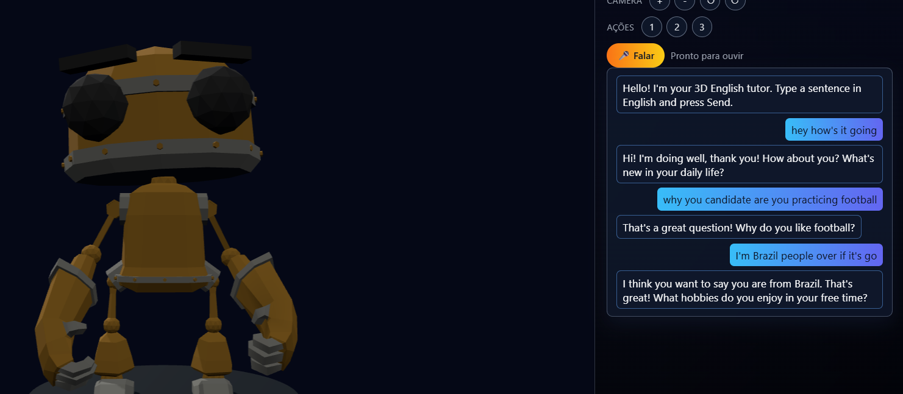

# 3D English Tutor NPC Prototype

This repository is a small prototype that provides an English tutor chat conversational. The NPC can speak  and performs simple talking animations.

<!-- Project image: place a screenshot or GIF here to show the UI in action -->


Add a screenshot or animated GIF at `frontend/screenshot.png` to show the project. The image will appear here in the README.

## Project structure

- `backend/`
  - `app.py` — Flask app serving the frontend and the `/chat` API.
  - `requirements.txt` — Python dependencies for the backend.
- `frontend/`
  - `index.html` — Main page and UI layout.
  - `main.js` — Three.js scene, NPC logic, chat integration and speech.
  - `style.css` — Styling for UI and scene.
  - `npc.glb` — (optional) 3D character model. If missing, a fallback cube is used.

## Requirements

- Python 3.8+ (for the backend)
- A modern browser with SpeechSynthesis and (optionally) SpeechRecognition support (Chrome, Edge, Firefox has limited voice support).

## Quick start (Windows)

1. Open PowerShell in the project root:

   ```powershell
   cd C:\Users\roger\Desktop\aws\npc
   ```

2. Create and activate a virtual environment, then install dependencies:

   ```powershell
   py -m venv backend\venv
   .\backend\venv\Scripts\Activate.ps1
   pip install -r backend\requirements.txt
   ```

   If PowerShell blocks the script, you can relax execution policy for the current session:

   ```powershell
   Set-ExecutionPolicy -ExecutionPolicy RemoteSigned -Scope Process
   .\backend\venv\Scripts\Activate.ps1
   ```

   Alternatively, with CMD:

   ```cmd
   backend\venv\Scripts\activate.bat
   ```

3. (Optional) Configure OpenAI API key to enable real AI responses. Create a file at `backend/.env` containing:

   ```text
   OPENAI_API_KEY=sk-REPLACE_WITH_YOUR_KEY
   OPENAI_MODEL=gpt-4o-mini
   ```

4. Run the backend server:

   ```powershell
   python backend\app.py
   ```

5. Open the app in your browser at:

   ```text
   http://127.0.0.1:5002/
   ```

## Frontend notes

- The frontend uses the browser `SpeechSynthesis` API to speak responses. Voice availability and names vary by browser and OS; you may need to reload the page to populate the voice list.
- If you want to force a specific voice, edit `frontend/main.js` where voices are selected in the `speak()` function.

## Usage

- Type an English sentence in the chat input and click **Send** (or use voice input if supported).
- The backend will reply with a short English message. If `OPENAI_API_KEY` is set, replies come from OpenAI; otherwise a demo fallback reply is returned.
- The NPC animates while speaking.

## Troubleshooting

- If the server fails to start, verify Python version and that dependencies are installed (`pip install -r backend/requirements.txt`).
- If speech is silent or uses an unexpected voice, check your browser's available voices and try a different browser (Chrome/Edge recommended for best speech support).
- If speech recognition doesn't work, your browser might not support `SpeechRecognition` or it may require a secure origin (HTTPS or localhost).

## Development

- Modify `frontend/main.js` to change voice selection, animation behavior, or UI.
- Modify `backend/app.py` to change system prompt or API usage.

## License

MIT — feel free to adapt this prototype for experimentation and learning.

